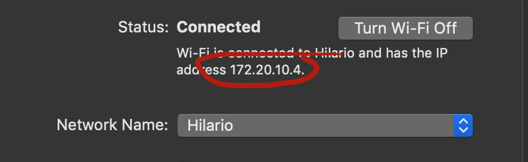

# <3^2


para lola


# The Basics

To run, open your 'Terminal' app and log into the Pi.
```bash
shh pi@raspberrypi.local
```
Enter the password when prompted, you should know it ;).
Once logged in to the Pi. Move into the Heart Rate example.

```bash
cd h2h/py/Pulse_Sensor
```
This will take you the heart sensor program.
to run it type the following, replacing the xx with your computer ip.
```bash
sudo python3 example --ip xx.xx.xx.xx
```
for the IP, open up network preferences and look for this.



## How to update

go to the `h2h` folder, and type the following.
```bash
git pull
```


[useful graphic](https://imotions.com/blog/measuring-the-heart-how-does-ecg-and-ppg-work/)

## links
[measuring heart beats in the raspberry pi](https://tutorials-raspberrypi.com/raspberry-pi-heartbeat-pulse-measuring/)

 1. https://reprage.com/post/how-to-connect-the-raspberry-pi-to-a-bluetooth-heart-rate-monitor
 2. https://www.bluetooth.com/specifications/gatt/characteristics
 3. https://nob.ro/post/polar_h10_ubuntu/
 4, https://blog.akhq.net/2014/11/polar-h7-bluetooth-le-heart-rate-sensor-on-ubuntu-14-04/
 5. https://discourse.reprage.com/t/how-to-connect-the-raspberry-pi-to-a-bluetooth-heart-rate-monitor/52/9
 6. https://github.com/danielfppps/hbpimon
 7. https://github.com/cal-id/Polar-H7-Pi/blob/master/animated_plot.py
 8. https://github.com/oroce/polar-h7-rr
 9. https://developer.polar.com/wiki/H6,_H7,_H10_and_OH1_Heart_rate_sensors
 10. https://www.google.com/search?client=firefox-b-1-d&ei=ENBjXOfCGNLcwQKlnYSQDw&q=polar+h7+uuid+mappings&oq=polar+h7+uuid+mappings&gs_l=psy-ab.3...5934.7593..8056...0.0..0.71.363.6......0....1..gws-wiz.......0i71.kFZuV5-Dhj4
 11. https://stackoverflow.com/questions/32749194/differences-between-cbuuid-and-nsuuid-in-swift
 12 https://github.com/adafruit/Adafruit_Python_BluefruitLE/blob/master/Adafruit_BluefruitLE/corebluetooth/objc_helpers.py
 13. https://mbientlab.com/tutorials/LPython2.html
- [polar h7 rr](https://github.com/oroce/polar-h7-rr)

polar uuid : 00:22:D0:8D:7D:98

//docs
https://github.com/getsenic/gatt-python
